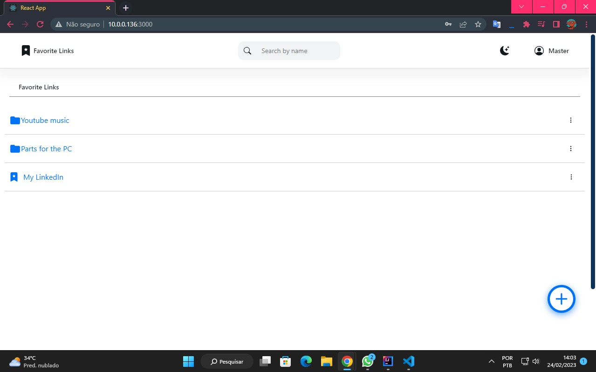

    
    
    

# Favorite Links web application with React JS

## Go to branch:

- <a href="https://github.com/JeandsonBarros/favorite-links-with-react-and-spring-boot/tree/back-end">Back-end</a> 
- <a href="https://github.com/JeandsonBarros/favorite-links-with-react-and-spring-boot/tree/front-end">Front-end</a> 
- <a href="https://github.com/JeandsonBarros/favorite-links-with-react-and-spring-boot/tree/mobile">Mobile</a> 

## Description
Application developed with React.js on the web front-end, React Native on mobile and Spring Boot on the back-end, to manage favorite links.

## Execute project

### Installation of dependencies
Open terminal in project directory and run 
following command in your terminal:

`npm i` or `npm install`

### Backend configuration
Run to the backend API available in the branch <a href="https://github.com/JeandsonBarros/favorite-links-with-react-and-spring-boot/tree/back-end">Back-end</a>.
