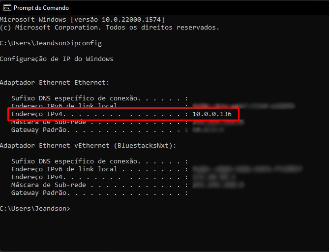

    
    

# API Favorite Links

## Go to branch:

- <a href="https://github.com/JeandsonBarros/favorite-links-with-react-and-spring-boot/tree/back-end">Back-end</a> 
- <a href="https://github.com/JeandsonBarros/favorite-links-with-react-and-spring-boot/tree/front-end">Front-end</a> 
- <a href="https://github.com/JeandsonBarros/favorite-links-with-react-and-spring-boot/tree/mobile">Mobile</a> 

## Description
This API has the following functionality:

- Authentication by token
- Send email to restore forgotten password
- User management
- Management of favorite links
- Management of favorite links folders
- Swagger documentation: http://localhost:8080/swagger-ui/index.html

## Getting Started

### Execution

To run the project it is necessary to have Java 17,
and a running database, preferably MySQL.
It is also necessary to pass the application.properties file settings,
these settings are information to connect to database,
and for sending emails with the forgotten password reset code.

### Reference Documentation
For further reference, please consider the following sections:

* [Official Apache Maven documentation](https://maven.apache.org/guides/index.html)
* [Spring Boot Maven Plugin Reference Guide](https://docs.spring.io/spring-boot/docs/3.0.2/maven-plugin/reference/html/)
* [Create an OCI image](https://docs.spring.io/spring-boot/docs/3.0.2/maven-plugin/reference/html/#build-image)
* [Spring Web](https://docs.spring.io/spring-boot/docs/3.0.2/reference/htmlsingle/#web)
* [Validation](https://docs.spring.io/spring-boot/docs/3.0.2/reference/htmlsingle/#io.validation)
* [Spring Data JPA](https://docs.spring.io/spring-boot/docs/3.0.2/reference/htmlsingle/#data.sql.jpa-and-spring-data)
* [Spring Security](https://docs.spring.io/spring-boot/docs/3.0.2/reference/htmlsingle/#web.security)
* [Spring Boot DevTools](https://docs.spring.io/spring-boot/docs/3.0.2/reference/htmlsingle/#using.devtools)

### Guides
The following guides illustrate how to use some features concretely:

* [Building a RESTful Web Service](https://spring.io/guides/gs/rest-service/)
* [Serving Web Content with Spring MVC](https://spring.io/guides/gs/serving-web-content/)
* [Building REST services with Spring](https://spring.io/guides/tutorials/rest/)
* [Validation](https://spring.io/guides/gs/validating-form-input/)
* [Accessing Data with JPA](https://spring.io/guides/gs/accessing-data-jpa/)
* [Accessing data with MySQL](https://spring.io/guides/gs/accessing-data-mysql/)
* [Securing a Web Application](https://spring.io/guides/gs/securing-web/)
* [Spring Boot and OAuth2](https://spring.io/guides/tutorials/spring-boot-oauth2/)
* [Authenticating a User with LDAP](https://spring.io/guides/gs/authenticating-ldap/)

